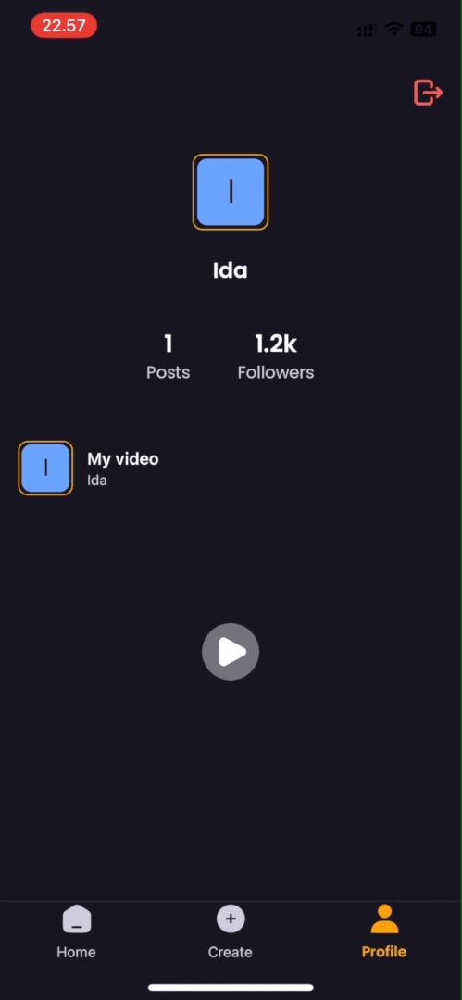
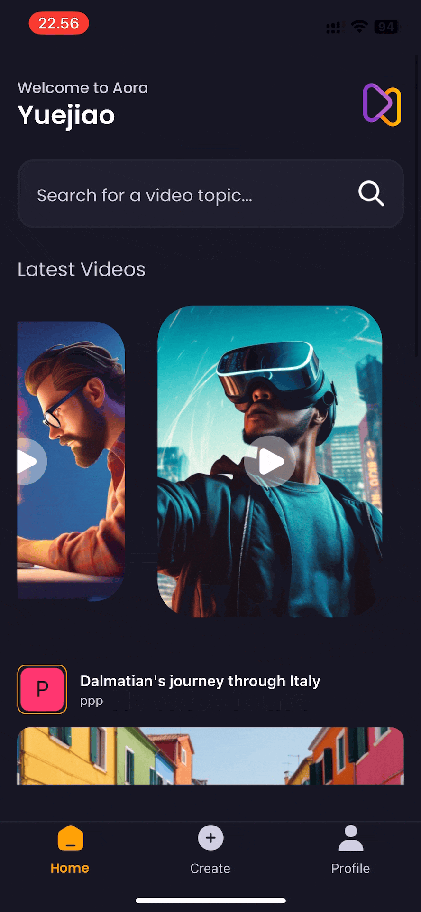

# Video Upload Platform

## Overview

This is a video uploading platform designed for users to upload, manage, and share their AI-generated videos with others. The platform is built using React Native for mobile applications with support for media upload, user authentication, and post management.

---

## Technologies and Libraries Used

-  Core framework for building cross-platform mobile applications.
-  A toolchain for streamlined React Native development.
-  Backend services for authentication, database, and file storage.
-  Manages global state for user data and authentication.
-  Ensures type safety and improves developer experience.

---

## Features

1. **Video Uploading**:

   - Upload videos and thumbnails from the device gallery.
   - Attach relevant metadata, such as title and AI prompt.
   - Submit the video for publication, allowing others to view it.

2. **Profile Management**:

   - View user profiles with the ability to display and manage uploaded videos.
   - Users can log out or delete videos directly from their profile.

3. **Authentication**:

   - User sign-up and login using email/password with Appwrite backend.
   - Protected routes ensure only authenticated users can upload or manage videos.

4. **Video Viewing**:
   - Users can view uploaded videos, with details like title, creator info, and more.

---

## App Structure

### 1. **Sign In and Sign Up Screen** (`SignIn.tsx SignUp.tsx`)

  

    
    
<strong>Sign In and Sign Up Screens</strong>

  

  
  

    
    
<strong>Sign Out Screen</strong>

  

- **Functionality**: Allows users to log into the app using their email and password.

- **Features**:
  - **User Authentication**: Authenticates the user using Appwrite’s backend.
  - **Form Validation**: Ensures both email and password fields are filled before submission.
  - **Navigation**: Redirects authenticated users to the home screen.

---

### 2. **Home Screen** (`Home.tsx`)

  

- **Functionality**: Displays a feed of all the uploaded videos from various users.

- **Features**:
  - **Video Feed**: Shows a list of videos uploaded by different users.
  - **Navigation to Details**: Clicking on a video navigates to a detailed view of the selected video.
  - **Search**: Enables users to search for videos by title or creator.

---

### 3. **Profile Screen** (`Profile.tsx`)

  

- **Functionality**: Displays user's uploaded videos and profile information, with a log-out option.

- **Features**:
  - **User Information**: Displays the user's avatar, username, and a count of their posts and followers.
  - **Log Out**: Allows users to securely log out of their account.
  - **Video List**: Shows a list of the user's uploaded videos, including video thumbnails and titles.

---

### 4. **Create Video Screen** (`Create.tsx`)

  

- **Functionality**: Allows users to upload a video with a corresponding thumbnail, title, and prompt.

- **Features**:
  - **Video Upload**: Allows the user to upload a video from the device.
  - **Thumbnail Selection**: Users can pick an image to serve as the video’s thumbnail.
  - **AI Prompt**: Enables users to include a description or prompt they used to generate the content.
  - **Validation**: Checks if all fields are filled before submission.
  - **Submission**: Handles the video upload and navigates back to the home page upon success.

---
